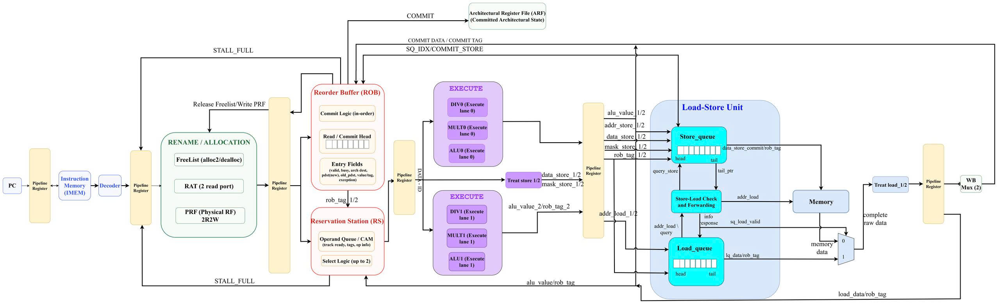
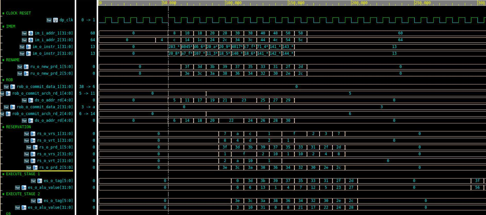
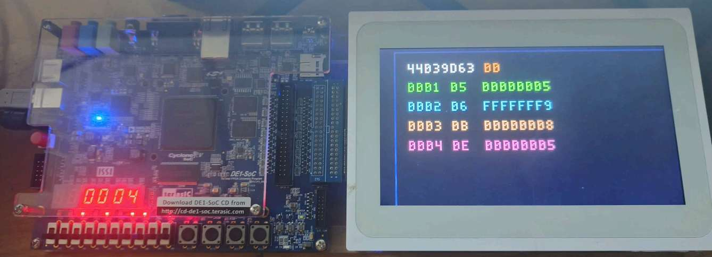
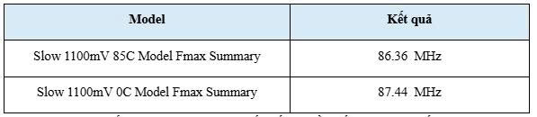
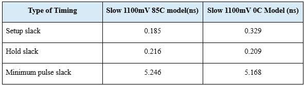
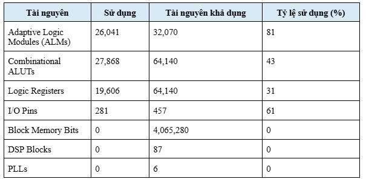

# RISC-V Superscalar Out-of-Order Processor

<!--
Demo link TODO:
Replace the placeholder below with your Google Drive or YouTube demo link.
Example:
[Video Demo](https://youtu.be/your-demo-link)
-->

**Demo:** [Watch the FPGA demo on YouTube](https://youtu.be/68C5KNC8-I0)

## Table of Contents

1. [About The Project](#about-the-project)
2. [Key Features](#key-features)
3. [Architecture Overview](#architecture-overview)
4. [Repository Structure](#repository-structure)
5. [Getting Started](#getting-started)
6. [How To Run](#how-to-run)
7. [Functional Verification](#functional-verification)
8. [FPGA Implementation Results](#fpga-implementation-results)
9. [Future Work](#future-work)
10. [Contact](#contact)

## About The Project

This repository contains the RTL source and verification flow for a 32-bit
RISC-V Superscalar Out-of-Order processor based on an improved Tomasulo-style
algorithm.

The design targets the RV32IM instruction subset and focuses on exploiting
instruction-level parallelism through a 2-wide superscalar datapath, register
renaming, dynamic instruction scheduling, and in-order commit. The processor is
implemented in Verilog/SystemVerilog and evaluated through RTL simulation,
RV32IM-clean directed assembly benchmarks, Quartus timing analysis, and FPGA
board execution.

## Key Features

- RV32IM instruction subset.
- 2-wide superscalar instruction flow.
- Out-of-order issue and execution.
- Register renaming using Rename Unit, RAT, Free List, and Physical Register File.
- Dynamic scheduling through Reservation Station.
- In-order commit through Reorder Buffer.
- Load/Store support with Store Queue, Load Queue, and store-load checking.
- Multi-cycle instruction support for RV32M operations.
- RTL simulation with Icarus Verilog and VVP.
- RV32IM-clean benchmark flow through Makefile targets.
- FPGA-oriented synthesis and timing evaluation on Cyclone V DE1-SoC.

## Architecture Overview

The processor follows a Tomasulo-style backend. Instructions are fetched and
decoded, renamed into physical registers, dispatched into the Reservation
Station and Reorder Buffer, issued to execution units when operands become
ready, and finally committed in program order.



Core microarchitectural blocks:

| Block | Role |
|---|---|
| Program Counter / Instruction Memory | Fetches instruction words. |
| Decoder | Decodes RV32IM instruction fields and control signals. |
| Rename / Allocation Unit | Performs register renaming and physical register allocation. |
| Physical Register File | Stores renamed operand values. |
| Reservation Station | Holds waiting instructions and selects ready operations. |
| Execute Units | Execute ALU, branch, multiply/divide, and memory-related operations. |
| Load/Store Unit | Handles load/store ordering, forwarding, and memory access. |
| Reorder Buffer | Tracks completion and commits architectural state in order. |
| Architectural Register File | Stores committed architectural register state. |

## Repository Structure

```text
src/                         RTL source files
test/                        Verilog testbench files
tools/                       Utility scripts for hex/program-info generation
riscv-tests-master/isa/      RV32IM-clean benchmark assembly tests
Makefile                     Main simulation and benchmark flow
GNUmakefile                  Make wrapper
images/                      README images and implementation result figures
```

## Getting Started

### Prerequisites

The flow is intended to run in WSL/Linux with:

- `riscv64-unknown-elf-gcc`
- `riscv64-unknown-elf-objcopy`
- `iverilog`
- `vvp`
- PowerShell, used by the helper scripts in `tools/`

Optional waveform viewer:

- `gtkwave`

On Ubuntu/WSL, install the common simulation tools with:

```bash
sudo apt update
sudo apt install -y make git iverilog gtkwave python3 powershell
```

Install the RISC-V bare-metal GCC toolchain. On some Ubuntu versions it is
available from the package manager:

```bash
sudo apt install -y gcc-riscv64-unknown-elf binutils-riscv64-unknown-elf
```

If the package is not available or does not provide the expected commands,
install a prebuilt toolchain such as SiFive or xPack, then add its `bin`
directory to `PATH`. After installation, these commands should work:

```bash
riscv64-unknown-elf-gcc --version
riscv64-unknown-elf-objcopy --version
iverilog -V
vvp -V
pwsh -Version
```

### Clone

```bash
git clone https://github.com/NguyenHoanKhanh/RISC-V-SUPERSCALAR-OUT-OF-ORDER.git
cd RISC-V-SUPERSCALAR-OUT-OF-ORDER
```

## How To Run

Run the full RV32IM-clean benchmark report:

```bash
make report_im
```

Run the currently loaded program and print commit information:

```bash
make run_raw_print
```

Run a single benchmark:

```bash
make add
make addi
make lw
make mul
```

The Makefile flow builds the benchmark, converts it to instruction hex,
updates program metadata, compiles the RTL testbench, and runs the simulation.

## Functional Verification

The main functional verification flow uses RV32IM-clean directed assembly
benchmarks. The testbench observes commit behavior and reports pass/fail status,
commit count, cycle count, and IPC.

Example local `make report_im` result:

```text
TOTAL | 37 | 15798 commits | 12852 cycles | IPC 1.229 | PASS
```

Functional execution evidence:



## FPGA Implementation Results

The design was synthesized and evaluated using Quartus for the Cyclone V
DE1-SoC FPGA platform. The following figures summarize board execution,
maximum frequency, timing, and resource usage.

### FPGA Board Execution



### Maximum Frequency



### Timing Summary



### Resource Utilization



## Future Work

- Improve branch prediction and frontend redirect handling.
- Extend safe speculation and rollback support.
- Optimize Load/Store Queue behavior.
- Improve Reservation Station wakeup/select timing.
- Reduce FPGA resource usage.
- Increase maximum operating frequency.
- Expand benchmark coverage beyond directed RV32IM-clean tests.

## Contact

Nguyen Hoan Khanh

Repository:

```text
https://github.com/NguyenHoanKhanh/RISC-V-SUPERSCALAR-OUT-OF-ORDER
```
